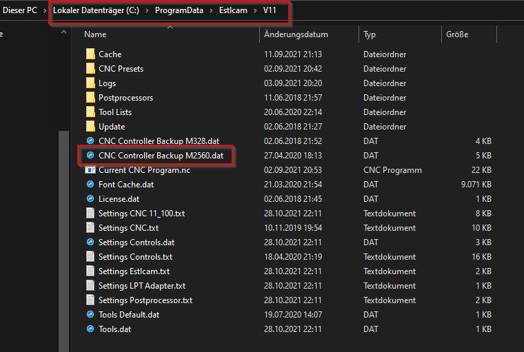

# laser grbl mit Estlcam

## Description
Angepasste Laser grbl für Arduino IDE zur Ansteuerung eines Arduinoclub Estlcam Mega2560 Controllers.

## Wie schalte ich um

- Im Verzeichnis "binary" liegt die compilierte Datei für das MEGA2560 Board. Diese ZIP-Datei enpacken und in das folgende Verzeichnis von Estlcam kopieren.   
```ruby
C:\ProgramData\Estlcam\V11\
```


Falls die Datei schon vorhanden ist, muss diese überschrieben werden.

- In Estlcam kann man jetzt mit den folgenden zwei Buttons umschalten.   


## Weblinks
- Es geht genau um diese Karte: https://www.arduinoclub.de/2020/04/11/estlcam-steuerkarte-mit-arduino-mega-und-handsteuerung/
- Hier geht es zu Estlcam: http://www.estlcam.de/
- YouTube Anleitung zur Umschaltung: 
Part 1: https://www.youtube.com/watch?v=5jDialYKdVM
Part 2: https://www.youtube.com/watch?v=p0W-TaUoB6c
