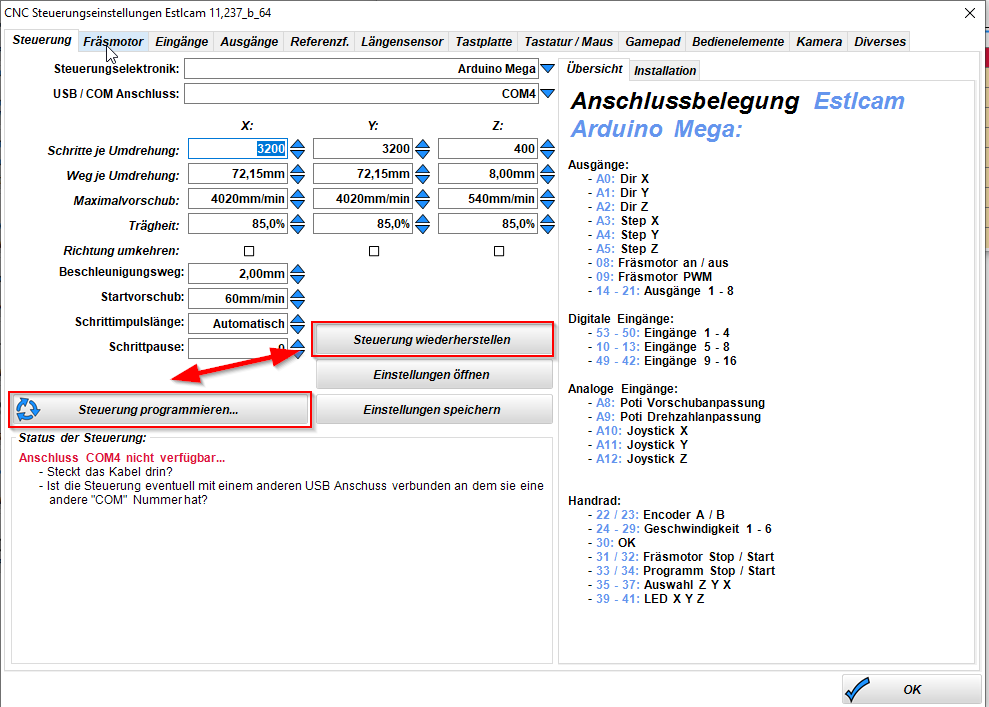

# laser grbl mit Estlcam

## Description
Angepasste Laser grbl für Arduino IDE zur Ansteuerung eines Arduinoclub Estlcam Mega2560 Controllers.

## Wie schalte ich um
In Estlcam kann man mit den folgenden zwei Buttons umschalten. Die grbl Firmware muss über die Arduino IDE hochgeladen werden.

## Weblinks
- Es geht genau um diese Karte: https://www.arduinoclub.de/2020/04/11/estlcam-steuerkarte-mit-arduino-mega-und-handsteuerung/
- Hier geht es zu Estlcam: http://www.estlcam.de/
- YouTube Anleitung zur Umschaltung: https://www.youtube.com/watch?v=p0W-TaUoB6c
